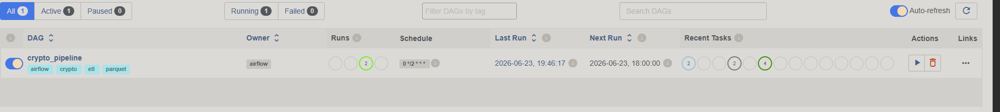
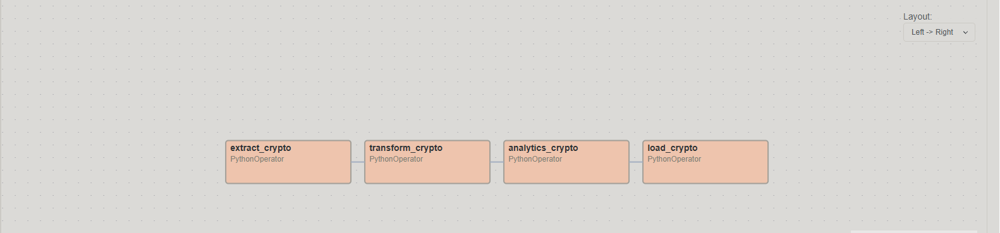
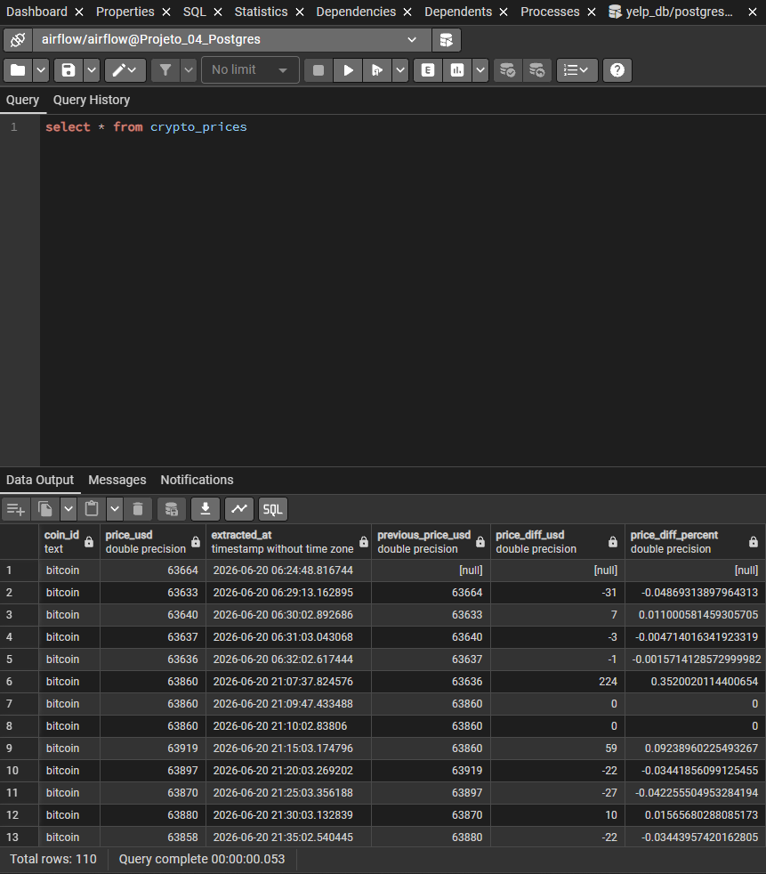
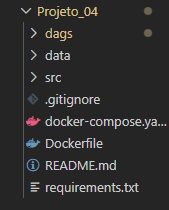

# Crypto Pipeline com Airflow, Docker e PostgreSQL

## Objetivo

Construir um pipeline ETL para coletar preços de criptomoedas da API CoinGecko, processar os dados em camadas Raw, Interim e Processed, calcular métricas de variação de preço e carregar o resultado final em PostgreSQL, com orquestração via Apache Airflow.

## Arquitetura

CoinGecko API
     ↓
Extract
     ↓
data/raw
     ↓
Transform
     ↓
data/interim
     ↓
Analytics
     ↓
data/processed
     ↓
Load
     ↓
PostgreSQL

Orquestração:
Apache Airflow

## Tecnologias

- Python
- Pandas
- Requests
- Apache Airflow
- PostgreSQL
- Docker
- Docker Compose
- SQLAlchemy
- Parquet

## Estrutura do Projeto

```text
Projeto_04/
├── dags/
│   └── crypto_pipeline_dag.py
├── src/
│   ├── extract.py
│   ├── transform.py
│   ├── analytics.py
│   ├── load.py
│   ├── config.py
│   └── main.py
├── data/
│   ├── raw/
│   ├── interim/
│   └── processed/
├── Dockerfile
├── docker-compose.yml
├── requirements.txt
└── README.md

## Fluxo da DAG

A DAG `crypto_pipeline` é composta por quatro tarefas executadas em sequência:

1. `extract_crypto`
   - Consome dados da API CoinGecko
   - Armazena os dados na camada Raw

2. `transform_crypto`
   - Consolida os arquivos Raw
   - Padroniza a estrutura dos dados

3. `analytics_crypto`
   - Calcula métricas e indicadores
   - Gera a camada Processed

4. `load_crypto`
   - Carrega os dados finais para PostgreSQL

Fluxo:

```text
extract_crypto
       ↓
transform_crypto
       ↓
analytics_crypto
       ↓
load_crypto
```

## Como Executar

### Clonar o projeto

```bash
git clone <url-do-repositorio>
cd Projeto_04
```

### Subir os containers

```bash
docker compose up -d
```

### Acessar o Airflow

```text
http://localhost:8080
```

Usuário:

```text
airflow
```

Senha:

```text
airflow
```

## Resultados

O pipeline realiza:

- Coleta automática de preços de criptomoedas
- Armazenamento em arquivos Parquet
- Processamento analítico com Pandas
- Persistência em PostgreSQL
- Orquestração e monitoramento via Apache Airflow

## Screenshots

### Airflow DAG



### Pipeline Execution



### PostgreSQL



### Project Structure

